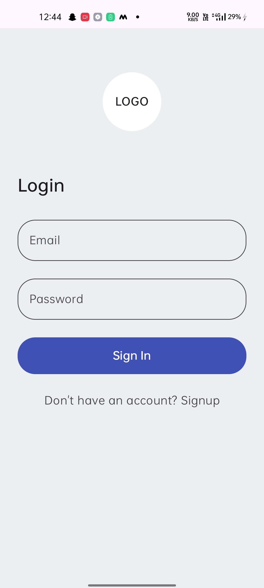
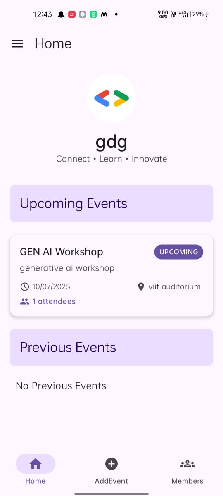
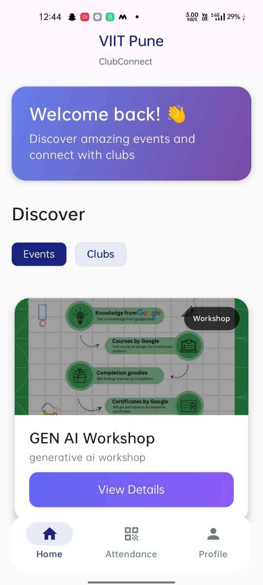
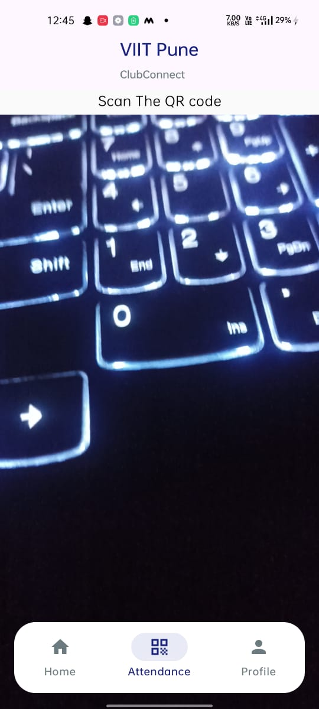
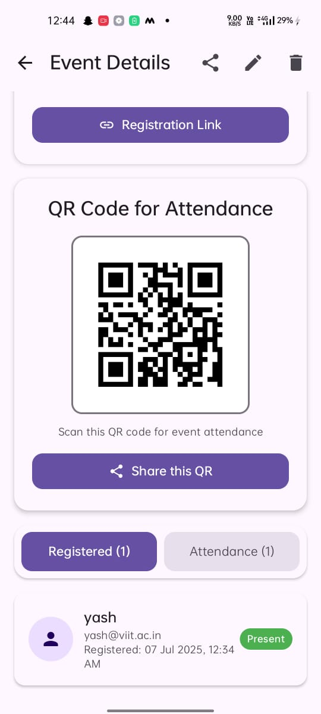

# 📱 ClubConnect

**ClubConnect** is a modern Android application built with **Jetpack Compose**, **Firebase**, and **MVVM architecture**, designed to streamline communication and event management between university clubs and students.

---

## ✨ Overview

ClubConnect serves as a digital bridge between **college clubs** and **students**, allowing seamless **event creation**, **announcements**, **club management**, and **event participation tracking**. It's tailored for students to stay updated and engaged with campus life while giving clubs a powerful tool to organize and promote their activities.

---

## 🚀 Tech Stack

- 🛠️ **Jetpack Compose** – Modern declarative UI
- 🔥 **Firebase** – Auth, Firestore, and Storage backend
- 🧠 **MVVM Architecture** – Clean separation of concerns
- 💉 **Hilt** – Dependency Injection
- 🌐 **Kotlin** – Primary development language
- ☁️ **Cloudinary / Firebase Storage** – For media uploads

---

## 👥 User Types

- 🎓 **Student**
- 🏛️ **Club**

Each user type has a tailored experience and UI in the app.

---

## 🔐 Authentication

- Email/password login via Firebase Authentication
- User type selection at sign-up (Student or Club)
- Persistent login session using Firebase

---

## 🗂️ Key Features

### 🎉 Events

- **Club-side:**
  - Create and manage events
  - Upload event posters
  - Add title, description, tags, venue, date
- **Student-side:**
  - Browse upcoming, ongoing, and past events
  - Filter events based on tags or interests
  - View detailed event info

### 📢 Announcements

- Clubs can post important updates or notices
- Students can view announcements from clubs they follow

### 📅 QR Code Attendance Tracking ✅

- Each event generates a **unique QR code**
- Students scan the QR code at the event to mark attendance
- Attendance records are saved and viewable by the club
- Optional manual attendance as backup

### 📋 Club Profile

- Add/edit logo, name, and description
- View event and member history
- Manage club details

### 👨‍🎓 Student Profile

- Edit name and profile picture
- View attended events
- Logout option

### 📂 Tagging & Filtering

- Events can be tagged (e.g., Tech, Cultural, Workshop)
- Students can filter events using tags

### 📥 Image Uploads

- Upload posters and profile pictures
- Stored in Firebase Storage or Cloudinary
- Optimized before upload for performance

### 🧪 Error Handling

- User-friendly error messages
- Graceful handling of Firebase/network issues

---

## 🖼️ Screenshots & Demo

| Screen               | Preview                         |
|----------------------|----------------------------------|
| Login                |          |
| Club Home            |      |
| Student Feed         |  |
| Event Creation       |   |
| QR Attendance (Student) |  |
| QR Attendance (Club) |        |

> 📽️ **[Watch Demo Video](https://drive.google.com/file/d/16D0SvbvClgmlsLFgfrjOTJKPtoqfKyxA/view?usp=drive_link)**

---

## 📦 Download APK

📲 **[Download Latest APK](https://drive.google.com/file/d/1_NPw3V9SAO-uLAHun6BW0Oxl0QOBu-ec/view?usp=drive_link)**

---

## 🧪 Test Credentials

### 👨‍🎓 Student Login
- **Email:** `yash@viit.ac.in`  
- **Password:** `yash123`

### 🏛️ Club Login
- **Email:** `gdg@viit.ac.in`  
- **Password:** `yash123`

> ⚠️ You can also register a new test account using the app.

---

Made with ❤️ by **Team ClubConnect**
